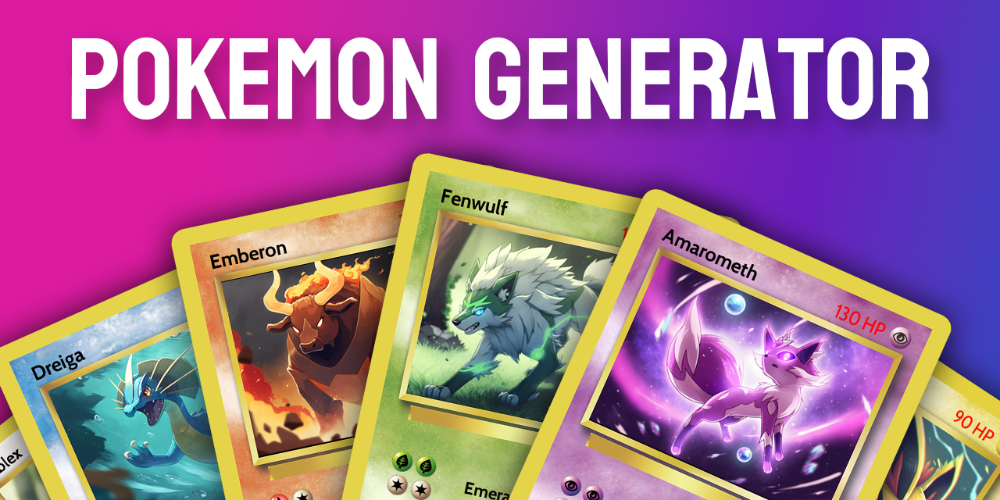
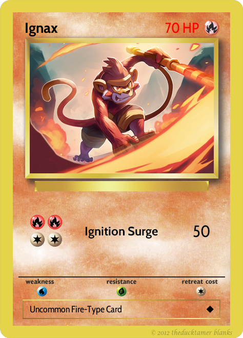
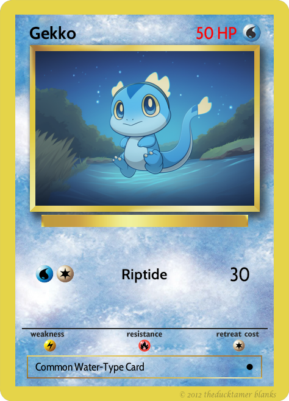
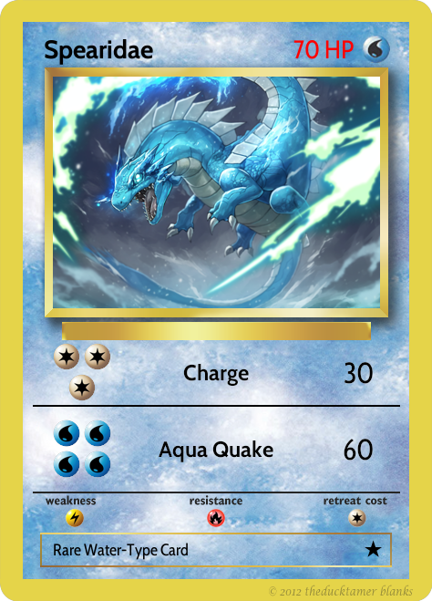
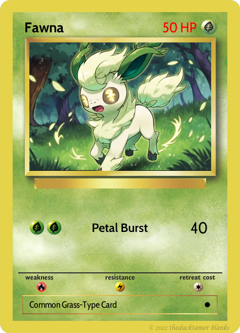
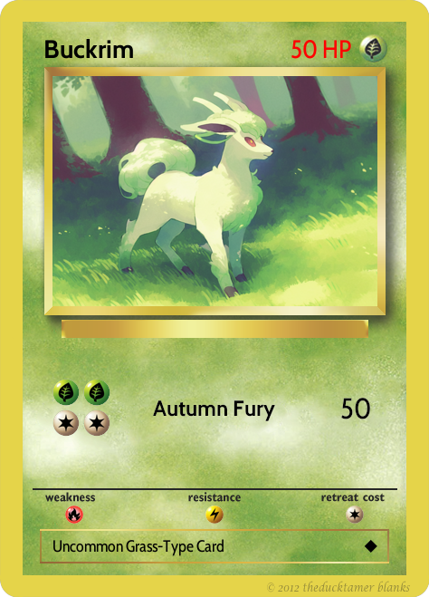
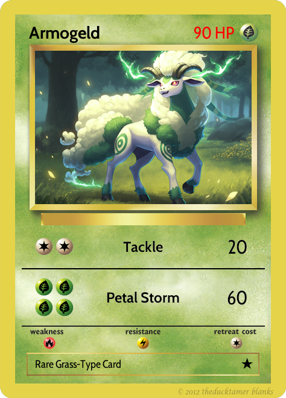
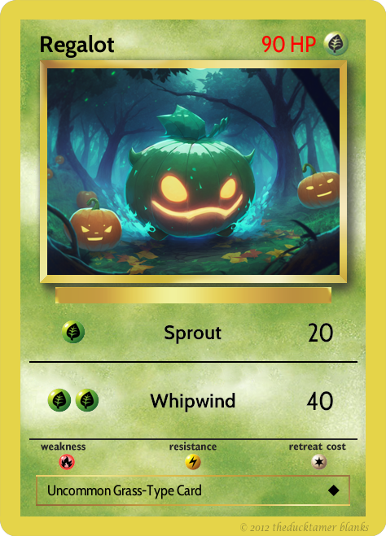
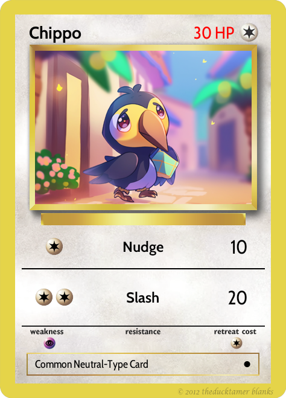
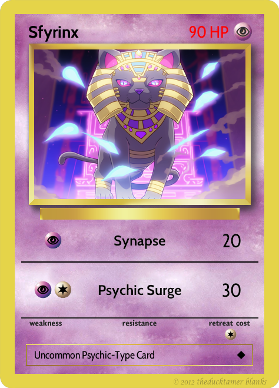

# Pokemon Card AI Generator



This is a Python script that **uses AI to generate new, random Pokemon cards.** It picks
from 6 elements and a type of creature, and random generates 1-2 abilities.

It then uses OpenAI to generate a Pokemon name and a description, and creates
a prompt for [Midjourney](https://midjourney.com/home) (which needs to be used manually).

Then a separate command can be used to combine the Pokemon data with the generated artwork to create a new Pokemon card.

# Final Results

## Card With Details

The finished generated card will have a name, description, and card artwork.

| Description                                                                                                                                                                                                                           | Card Image                                  |
| ------------------------------------------------------------------------------------------------------------------------------------------------------------------------------------------------------------------------------------- | ------------------------------------------- |
| Ignax is a sweltering hot Pokemon found in desert-like regions that brandishes a deadly dark axe. It is known for its fierce demeanor and its Ignition Surge ability, which it uses toits advantage in fierce, awe-inspiring battles. |  |


## Series Of Cards (Evolution)

The script can also generate a series of cards that evolve from one another.

| Form 1                                      | Form 2                                          | Form 3                                              |
| ------------------------------------------- | ----------------------------------------------- | --------------------------------------------------- |
|  |    |  |
|  |  |    |

For the full example collection, see [the gallery](./gallery).

## Metadata

The output will be in the `/output` folder, with empty folders for you to put card artwork into.

```
[project root]
├───output
    ├───cards
    ├───images
```

The cards will have JSON like this:

```json
{
  "index": 26,
  "name": "Flamo",
  "description": "...",
  "element": "Fire",
  "rarity": "common",
  "rarity_index": 0,
  "hp": 50,
  "abilities": [
    {
      "name": "Scorch",
      "element": "Fire",
      "cost": 2,
      "is_mixed_element": false,
      "power": 40
    }
  ],
  "image_prompt": "a chibi young fire-type parrot pokemon, in a volcano environment, lava texture background, anime chibi drawing style, pastel background --niji --ar 3:2",
  "image_file": "026_flamo.png"
}
```

You can use the `image_prompt` to generate the card artwork with Midjourney.

# Setup

1. Install Python 3.10 (or higher)
2. Install the dependencies with `pip install -r requirements.txt`
3. Set your PYTHONPATH to the `src` so that the modules can be imported.

   ```bash
   # For bash, you can use:
   export PYTHONPATH=$PYTHONPATH:src
   ```

## OpenAI and Midjourney

If you want to use OpenAI to generate names and descriptions, you will need to set up an account with [OpenAI](https://openai.com/).

Then put your API key into a file called `.env` in the root of the project.

```bash
# In your .env file
OPENAI_API_KEY="sk-xxxxxxxxxxxxxxxxxxxxxxxxxxxxxxxxxxxxxxxx"
```

If you want AI generated artwork, you will also need to set up an account (just join their Discord) with [Midjourney](https://midjourney.com/home).

# Usage

Running this will generate a collection of Pokemon to the `output` folder. **WARNING!** Each time you run this, it will overwrite the existing files in the `output` folder.

## Generate Cards (1 Series Per Element)

```bash
python src/generate.py
```

This will generate card `json` files, 1 card series (between 1-3 cards) for each element. The rarity, creature type, and number of evolutions of the cards will be random.

You will see the summary of the card series generated:

```
Chippo (Neutral)
HP: 30
Rarity: ★  (common)
Abilities:
  Slash (Neutral)
  Cost: ● ●
  Power: 20

Description: [...]
Image Prompt: [...]
```

## Generate Cards (10 Series Per Element)

```bash
python src/generate.py -n 10
```

## Generate Cards of a Specific Element

```bash
python src/generate.py -e fire
```

This will only generate cards for the `fire` element. Available elements are: `fire`, `water`, `grass`, `electric`, `psychic`, `neutral`.

## Generate Cards of a Specific Create Type

You can also specify a specific creature type (subject) to generate cards for. This will override the default subject selection (which is random).

```bash
python src/generate.py -e grass --subject pumpkin
```

You can literally put anything here! Have fun with it 😄

| Pumkpin                                     | Toucan                                    | Sphinx                                     |
| ------------------------------------------- | ----------------------------------------- | ------------------------------------------ |
|  |  |  |

## Use Midjourney to Generate Card Artwork

You can use the `image_prompt` to generate the card artwork with Midjourney. The image prompt will be in the `json` file for each card (and also in the `image_prompts.txt` in the `output` folder).

```
Chippo::0 a chibi young neutral-type toucan pokemon, in a village environment, bright lighting, anime chibi drawing style, pastel background --niji --ar 3:2
```

Copy this into the Midjourney `/image` prompt. It will generate 4 variations of the image. You can then upscale it by pressing one of the `U` buttons on the bot.

Download and save the image into the `output/pokemon-classic/images` folder. Then rename the file to match the `image_file` in the `json` file (e.g. `001_chippo.png`).

## Render the Cards

You can use the `render_carrds.py` script to render the cards into a PNG file. It will go into your `output/pokemon-classic/renders` folder.

```bash
python src/render_cards.py
```

Any cards that have an image file in the `output/pokemon-classic/images` folder will be rendered. If no image is found, it will render a blank card.

### Available Elements

| fire                                         | water                                          | grass                                          | electric                                             | psychic                                            | neutral                                            |
| -------------------------------------------- | ---------------------------------------------- | ---------------------------------------------- | ---------------------------------------------------- | -------------------------------------------------- | -------------------------------------------------- |
|  |  |  |  |  |  |

### Acknowledgements

Thanks to [TheDuckTamerBlanks](https://www.deviantart.com/katarawaterbender) for the blank card template.
