# Gallery

Here are some examples of Pokemon cards that have been generated using this tool.

You can click on them to see the full sized version.

|                                           |                                           |                                               |                                           |                                           |                                             |
| ----------------------------------------- | ----------------------------------------- | --------------------------------------------- | ----------------------------------------- | ----------------------------------------- | ------------------------------------------- |
|            |        |          |            |    |          |
|        |      |    |      |    |  |
|        |    |      |    |    |    |
| 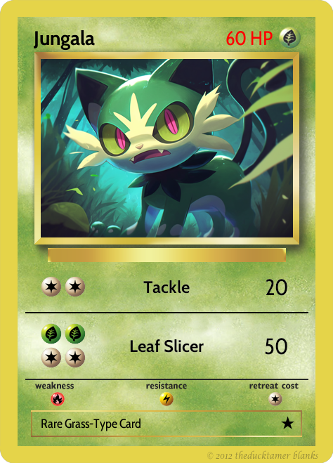   | 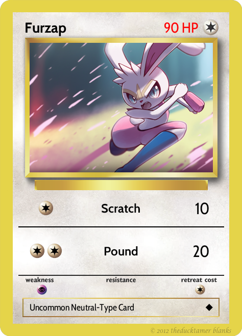     | 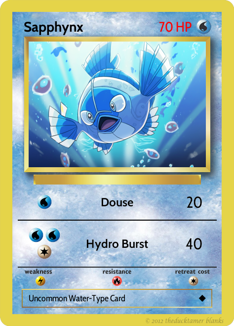     | 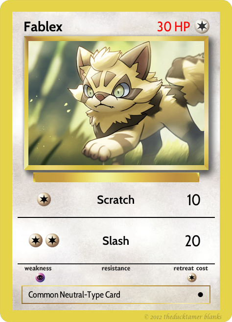     | 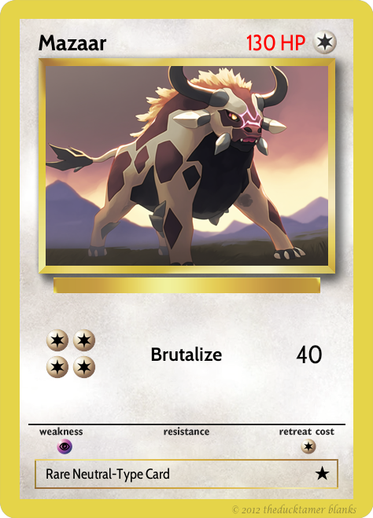     | 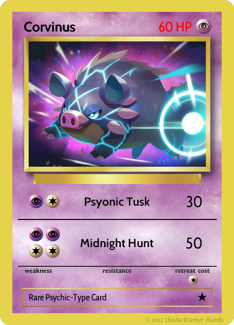   |
| 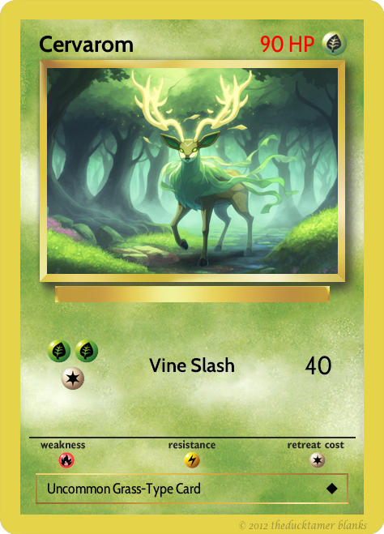 |      | 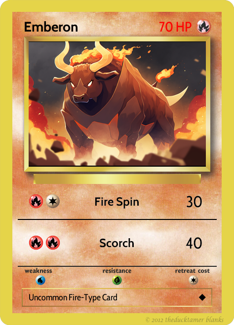       | 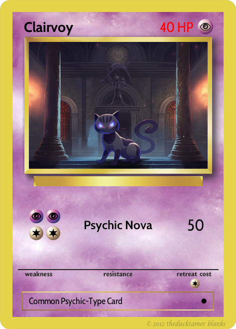 |  | 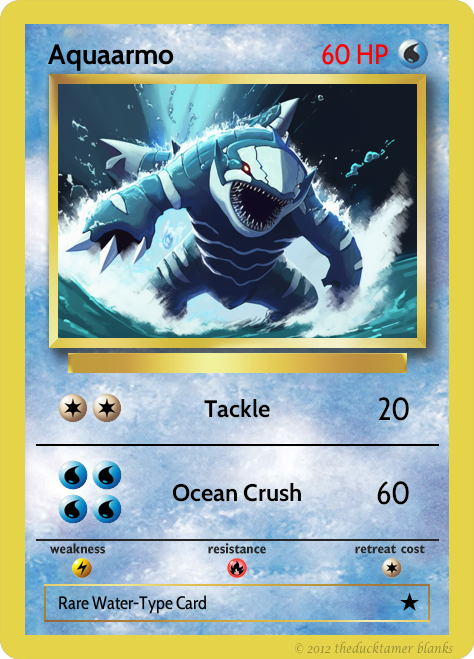   |
| 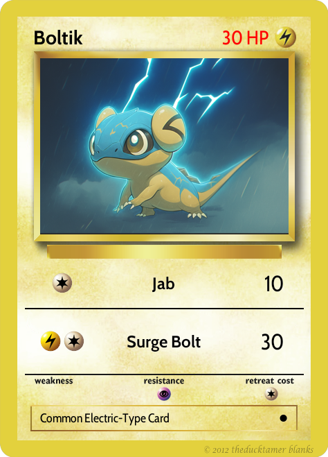     | 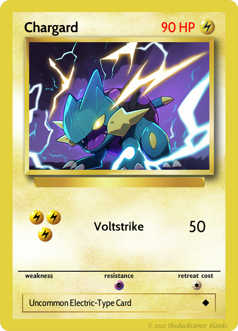 | 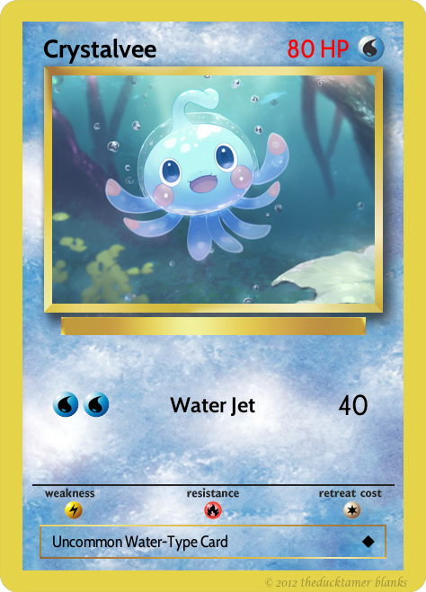 |    | 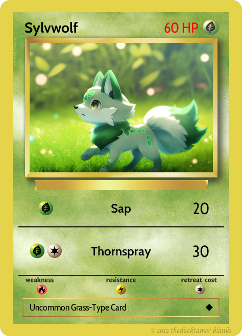 | 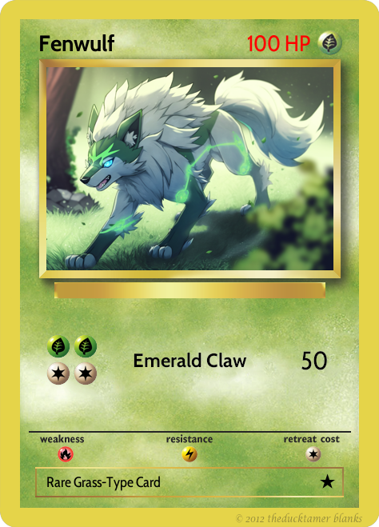     |
| 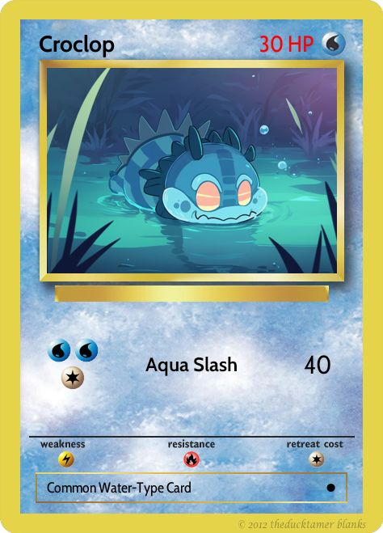   | 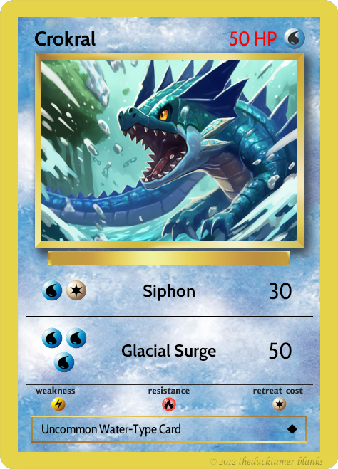   | 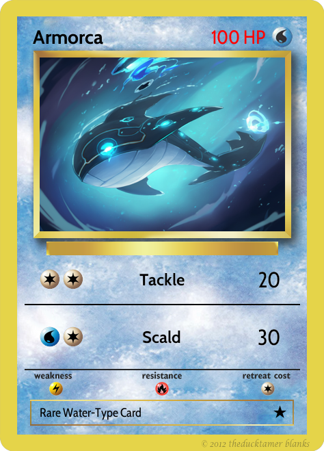       | 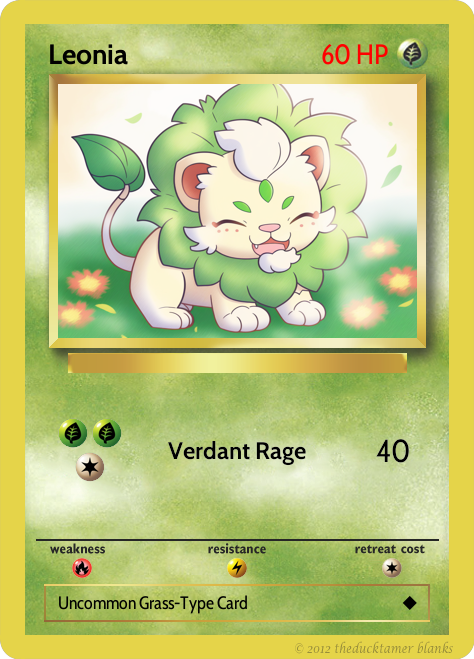     | 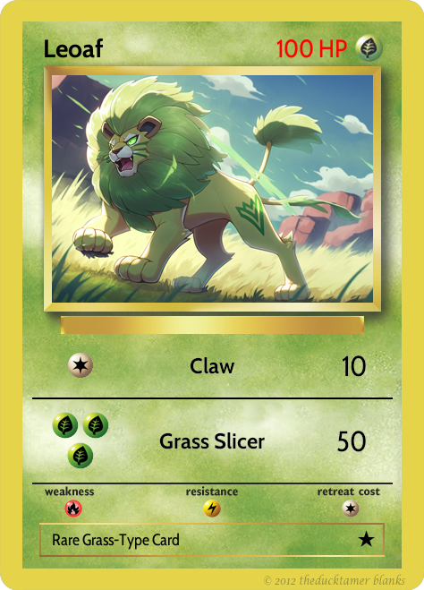       |          |
|    |        | 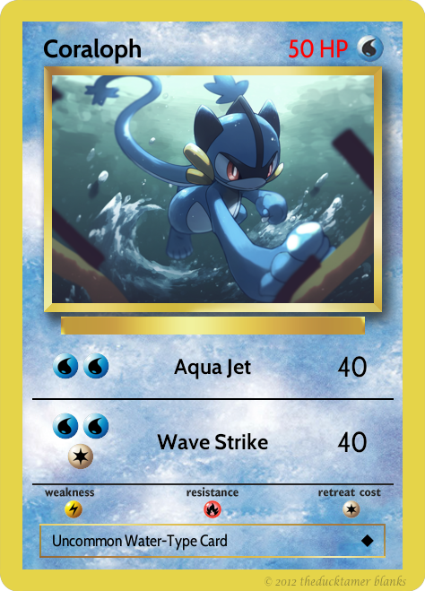     | 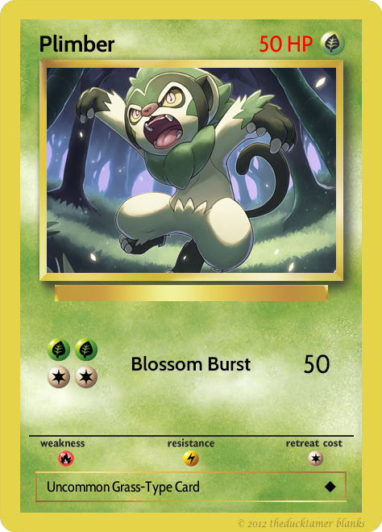   | 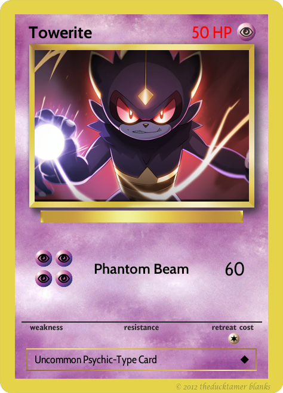 | 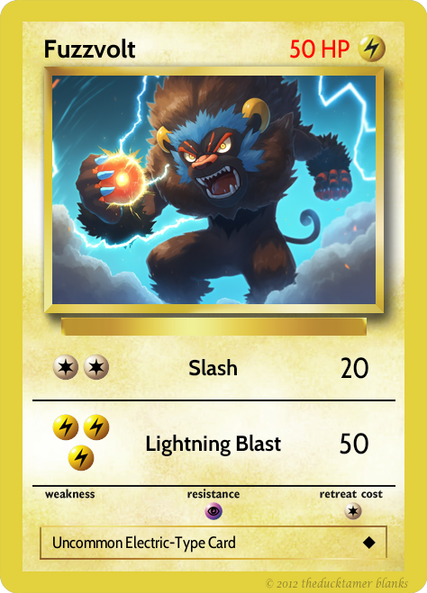   |
